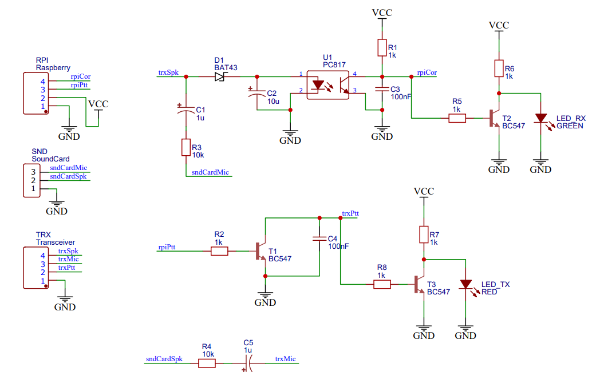
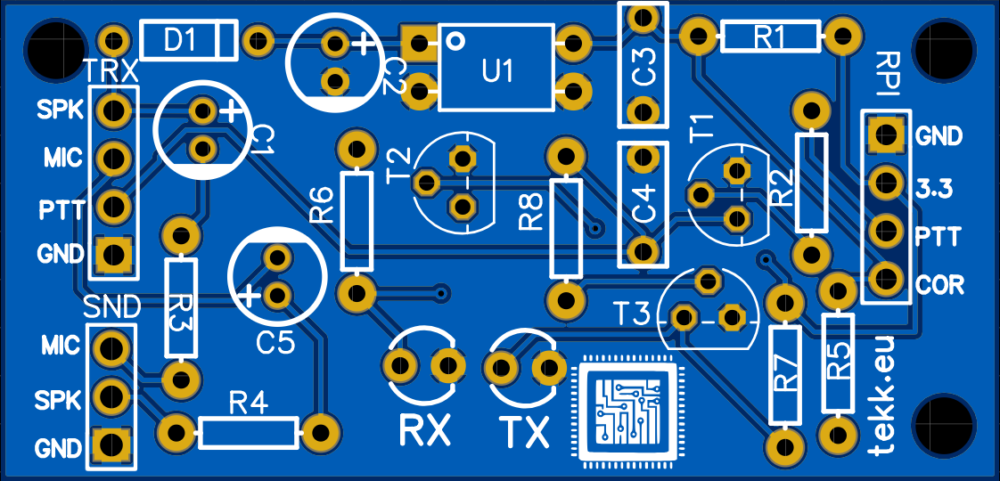
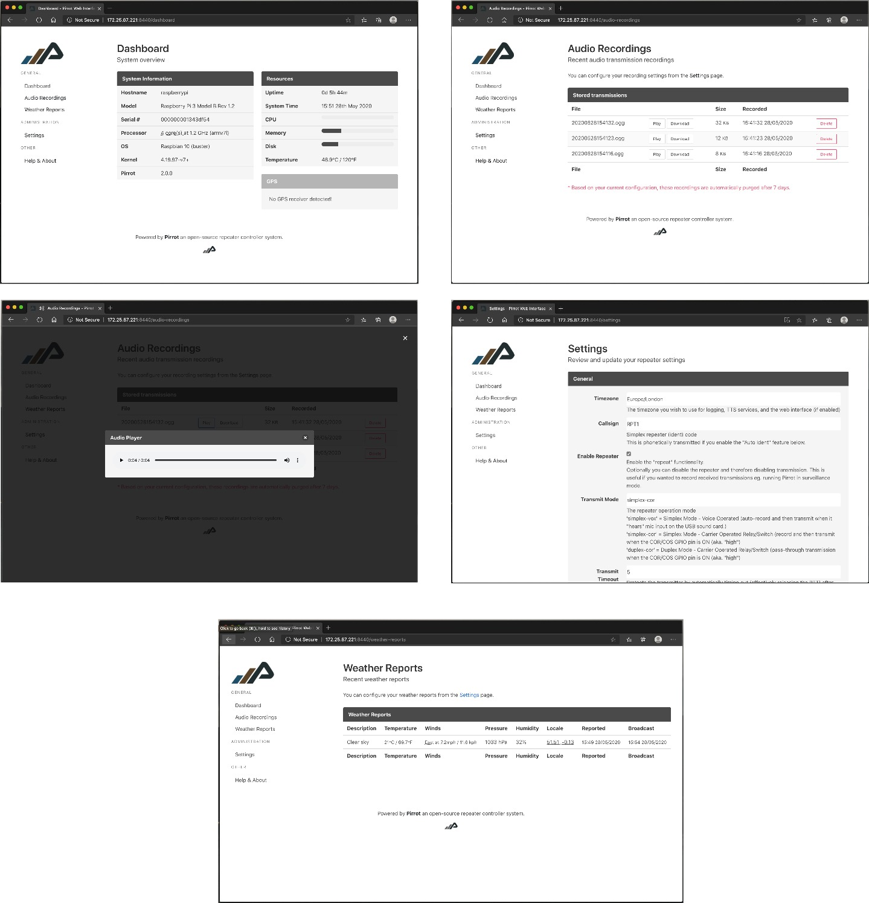

# Pirrot - An Open-source Radio Repeater controller for RaspberryPi

**Big news: Pirrot will soon be renamed to "Pirranha" and the project will be relocated to it's own GitHub org, you'll soon be able to find it here: https://github.com/pirranha/pirranha, we also have a ton of new features and improvements coming soon including a new website (https://pirranha.org) and Discord server!**

The Pirrot project exists to offer a cheaper (and fun) alternative to buying a dedicated simplex or duplex radio repeater controller.

Pirrot also offers other operation modes and features that most off-the-shelf repeater controllers do not come with as standard such as automatic identification, the ability to operate in "surveillance mode" (recording transmissions).

You can find a list of user projects to get inspiration from [below](https://github.com/allebb/pirrot/blob/master/README.md#pirrot-being-used-in-the-wild).

## Features

* Operate a Simplex or Duplex repeater system from a Raspberry Pi (Pirrot runs in Simplex mode by default)!
* Optional web admin interface to update settings, view system resource usage, access (download, play or delete) audio recordings.
* Optional automatic repeater identification broadcasts (disabled by default).
* Ability to transmit the PL/CTCSS tone as part of the repeater identification broadcast.
* Ability to transmit a custom pre-recorded (MP3 file recording) broadcast or custom repeater identification message.
* Ability to broadcast custom text-to-speech messages.
* Ability to trigger repeater transmission using VOX (voice activation) or COR (carrier signal from radio to trigger a PTT relay).
* Optional recording of received transmissions (disabled by default).
* Optional automatic nightly backups and archiving of audio recordings to a remote server (FTP and FTPS supported).
* Automatically purge old recording from the SD card (keeping that SD card from getting full).
* Optional integration with GPS hardware for "field" or "mobile" operations, ensuring the RPi has accurate time (using the atomic clocks from GPS satellites).
* Optional weather report broadcasts for a specified location (requires an internet connection and a free [OpenWeatherMap account](https://openweathermap.org/) API key)
* Optional Google Text-To-Speech functionality for translatable broadcasts and generating synthesised weather report broadcasts (requires an internet connection and a [Google Cloud](https://console.cloud.google.com/?pli=1)  API Key)
* Ability to dispatch a web hook when the repeater is activated (requires an internet connection) - We call this feature "Tripwire".
* Ability to optionally delay the transmission of a received simplex messages for a configurable time period.
* Ability to set a custom courtesy tone on end of transmission.

See the full list of configuration items on the [CONFIGURATION page](CONFIGURATION.md).

## Hardware requirements

The simplest hardware/software requirements are:

1. **A RaspberryPi** - I test Pirrot on the **RaspberryPi 3, 4 and the Zero W** but should work on other models too!
2. **RaspberryPi OS 11 (bullseye)** is recommended but older versions of Pirrot will run on Raspbian version **9 (stretch)** and **10 (buster)** too! You can install and use ___either the "lite" or "desktop" versions___ of Raspbian (I would personally recommend the "lite" version as it uses less system resources especially if you intend to run it headless).
3. **An external USB sound card**.

I will update the installer to support newer versions of Raspbian as and when they are released by the Raspberry Pi foundation.

Assuming you wish to use this with a radio transceiver and do not wish to use "VOX mode", you will also need to wire up the transceiver's PTT button to the PTT relay pin on your RaspberryPi's GPIO pin (by default this is GPIO Pin #23, although you can adjust as required in the configuration file found at ``/etc/pirrot.conf``).

The audio in (receive) and audio out (transmit) connectors from your radio will need to be connected to the external USB sound card using the Mic Jack (for Transmit) and Speaker Jack (for Receive).

If you plan to use the repeater in COS/COR mode you will need to connect your COR GPIO pin to the transceiver. 

## Installation

Pirrot can be installed using Git or by downloading the latest tarball ([find the version number here](https://github.com/allebb/pirrot/releases)), installation steps are as follows:

To install using Git (**the recommended way** - this supports easy future updates using 'pirrot update' command) run the following commands at the terminal:

```shell
sudo apt-get install -y git
sudo git clone --single-branch --branch latest-stable https://github.com/allebb/pirrot /opt/pirrot
cd /opt/pirrot
sudo make install
```

Alternatively you can install Pirrot by downloading the latest tarball, **replace the X.X.X with the latest version available from the ([releases page](https://github.com/allebb/pirrot/releases))**:

```shell
cd ~
wget https://github.com/allebb/pirrot/archive/vX.X.X.tar.gz
sudo mkdir /opt/pirrot
sudo tar xf vX.X.X.tar.gz -C /opt/pirrot --strip 1
cd /opt/pirrot
sudo make install
```

Once installed, Pirrot will start automatically at boot up (ensure your USB audio adapter is connected though!)

## Configuration options

The Pirrot configuration file is found in ``/etc/pirrot.conf``, a full list of settings and descriptions can be found on the [configuration](CONFIGURATION.md) page.

When making changes to this file please ensure that you restart the Pirrot daemon by running ``sudo service pirrot restart`` to ensure that the changes to take affect.

## Sound adjustment

Using the ``alsamixer`` command in the terminal you can adjust your microphone and speaker volumes if required.

If you do adjust the volume, remember that to permanently save these settings use the ``alsactl store`` command to ensure they are kept after reboot.

## Default GPIO pins

By default, the Pirrot configuration file, located in ``/etc/pirrot.conf`` has default GPIO pins configured, these are as follows:

* __GPIO 18__ - COR Signal (Input/Relay) - _Triggered when the radio squelch is opened._
* __GPIO 23__ - PTT Switch (Output/Relay)  - _Triggers the PTT on the radio to transmit._
* __GPIO 17__ - Power/Ready LED (Output/LED) - _Illuminates when the Pirrot daemon is running (indicating that the repeater is ready and working)._
* __GPIO 27__ - Receive LED (Output/LED) - _Receiving transmission (Illuminated when COR signal is high **non-functional in VOX mode**)._
* __GPIO 22__ - Transmit LED (Output/LED) - _Transmitting transmission (Illuminated when the repeater is ident-ing/playing back a transmission)._

__Remember: When making changes to the ``/etc/pirrot.conf`` file you must restart the daemon using the ``sudo service pirrot restart`` command.__

# Uninstalling

If you wish to uninstall Pirrot at a later date, you can run:

```shell
cd /opt/pirrot
sudo make uninstall
```

# PCB Interface (for Simplex mode)

This PCB interface design and PCB schematic has kindly been designed and contributed by Peter Javorsky ([@tekk](https://github.com/tekk)); and provides a simple interface (if you don't want to build your own circuit) to connect your radio(s) to a Raspberry Pi running Pirrot.





You can find out more about the [PCB and interface here](pcb/README.md).

You can edit or order the fabrication of this PCB online at: https://easyeda.com/integrac/rpi-repeater

If you use this interface board, you should configure the Pirrot output pin settings (in ``/etc/pirrot.conf``) with the following values:

| Description | Setting Name | Value to be set |
|:----|:--------------|:------------|
| RaspberryPi PTT pin | ``ptt_pin_invert`` | false |
| RaspberryPi COR pin | ``cos_pin_invert`` | true |

**Remember to restart Pirrot by running ``sudo service pirrot restart`` for the changes to take affect.**

# PCB Interface (for Duplex mode)

**Duplex operation mode is new since v2.0.0 and as such a PCB design is not yet available.**

In Duplex mode, Pirrot provides all the same features (audio recordings, weather reports, web hooks etc.) that Simplex mode does with the exception that VOX triggered transmissions are not supported.

When running in Duplex mode you should create a custom wiring loom between the RX and TX radios, the audio output from the receive radio should be connected to the audio input of the transmit radio in addition to feeding the ``MIC IN`` port on the Raspberry Pi connected USB Audio device. The ``AUDIO OUT`` (Speaker) from the USB Audio device from the Raspberry Pi should also be connected to the transmit radio's audio input; using ``alsamixer`` (more info on this above - see the "Sound adjustment" section) you can then balance the audio levels as desired.

The decision was taken not to use audio loopback in software (alleviating the need for direct connection between the TX and RX radios) given latency issues during testing (hence the need for a custom wiring loom), the result however is that Pirrot can provide all the same functionality as when it is running in Simplex mode whilst ensuring audio latency is not an issue.

We hope to provide a PCB design soon for a Duplex compatible interface.

# The optional web interface

Since v2.0.0 of Pirrot, I have implemented a light-weight admin web interface that provides easy access using a remote computer or table device to update Pirrot settings, view hardware stats (temperature, CPU and RAM utilisation, and disk usage etc.) as well as access and listen to and/or download transmission recordings (if enabled in the config file too).

**Pirrot is designed to run on resource restricted SBC's as well as battery operated systems in the field and therefore, by default, I have taken the decision to disable the admin web interface by default to ensure that Pirrot and your Raspberry Pi uses as little power and resources as possible out of the box.**

If however system resources and power consumption is not an issue for you/your intended use, you can easily enable it; when enabled, the web interface will be available and accessible using: http://{ip-address}:8440, you will be prompted for access credentials, by default these are as follows:

| Name | Value |
|:----|:--------------|
| Username | ``admin`` |
| Password | ``pirrot`` |

To enable the web interface, you must edit ``/etc/pirrot.conf`` and change the setting ``web_interface_enabled`` to ``true`` you will then need to restart the Pirrot daemon before the web interface will be activated, to restart Pirrot you should run ``sudo service pirrot restart``.

You can set a new admin password for the web interface (and I highly encourage you to do so) by running the following command at the console: ```sudo pirrot setwebpwd --password={YourPasswordHere}```.



# Pirrot being used in the wild

Below is a compiled list of known projects and/or articles that have been created by users of Pirrot.

I hope you can visit these great project sites and get some inspiration to build your own using the Pirrot software.

* [Margirine Man's Baofeng BF-888S Compact Repeater Project](https://www.mdshooters.com/showthread.php?t=244553) (based on a Raspberry Pi Zero W) 


__If you have a write-up, blog post, photo gallery, or know of a project using Pirrot, please let me know by emailing me at ballen@bobbyallen.me and I'll get the article/gallery linked here to help and/or inspire others.__

# Useful notes and tips

I thought I would share a list of useful notes, ideas and other interesting RaspberryPi setup related items that may help with your Pirrot-based repeater or other RaspberryPi related projects.

## Remote desktop access to your RaspberryPi
If you intend to run Pirrot on a Raspberry Pi and opt for the "Desktop" version of Raspbian instead of the "Lite" version, you may wish to access the desktop remotely, I personally prefer the RDP protocol and find it superior to VNC,  luckily you can easily install ``xrdp`` (an open-source server implementation of the RDP protocol) on your RaspberryPi with just a few commands:

```shell
sudo apt-get update
sudo apt-get install xrdp
sudo adduser xrdp ssl-cert
```

You can then access your Raspberry Pi's desktop using another computer, tablet device or mobile phone - simply download and install an RDP client (sometimes referred to as Microsoft Remote Desktop client) on your device(s).

## Keeping the correct time with no internet access

If you're using your Raspberry Pi remotely (outside and/or away from an internet connection), the Raspberry Pi does not have an on-board RTC (real-time clock) and without access to the internet your Raspberry Pi will not keep accurate time due to the unavailability of an NTP (Network Time Protocol) server.

There are two solutions to this, they are as follows:

1) **Buy an RTC HAT** - This will keep time as long as the small onboard supplied battery has charge.
2) **Buy a GPS HAT or USB dongle** - A much better solution in my opinion, not only does this keep the RaspberryPi's clock in sync (from satellites) but Pirrot (if it detects a GPS receiver configured on your Pi) will also output your current GPS location on the web interface dashboard too - useful if using this in a car or "go-box" type of setup.

Follow [this guide](#) to setup a USB GPS dongle on your Raspberry Pi.

## Auto WiFi hotpot when the RaspberryPi is away from it's primary WiFi Network

If you are running your RaspberryPi remotely (maybe in a "go-box", car or a remotely located repeater site) it is likely that you will not have a WiFi network or internet connection at the site or location.

In this scenario I will assume that you primarily use the RaspberryPi remotely and would like access to the RaspberryPi from a laptop, tablet or other mobile device in order to access it (such as over HTTP, SSH or even xRDP) but when we bring it back in-range of our primary location (eg. a home or office) it will auto-connect to our main WiFi network (which has internet access) and thus can access the internet again, install updates etc.

The solution is to configure the RaspberryPi to "switch" it's WiFi adapter into "Hot Spot" mode (and advertise a WiFi network that we can connect to from our mobile devices) when it cannot detect and connect our Home or Office WiFi network.

Follow [this guide](#) to configure your RaspberryPi as an "auto" remote hotspot.

